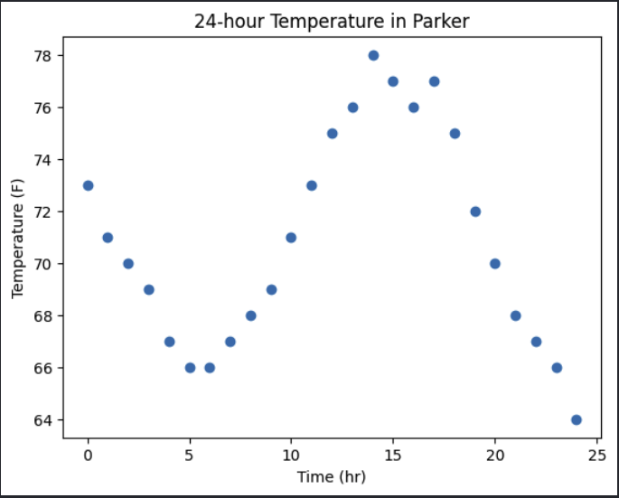
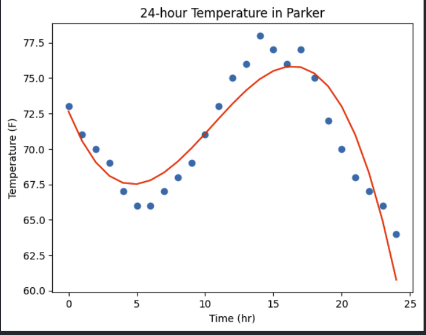

# 24 Hour Weather Forecast with least squares calculation

Least Squares Weather Data Discussion:

Use the website http://weather.gov to gather 24 hours of data in an area of your choosing. Graph this data and decide on an appropriate model for your data, and set up your basis of functions. Set up and solve a least squares system of linear equations to fit the data to your model. Why do you think your model is the best one for the job? Can it be used to predict temperatures outside of the 24-hour period? Why or why not?

Steps to solving this problem:

1) Get 24 hours of weather data from a location and plot the data

2) Choose a basis function to augment and implement your data

3) Set up a least squares system of linear equations

4) Calculate the residuals and replot the data

5) explain

I decided to gather data from my location, Parker, CO.

x_time =  y_temp =

I initially chose a cubic function with weighted least squares for this data since it has minima and maxima, but after doing some further investigation, I realized that the data forms a sinusoidal wave, and a workaround with the Fourier series could work, but how was I going to do that? I'll start with the polynomial for the first estimation, and then, if I have time, I'll investigate the Fourier series and post it in the comments below.&nbsp;

In order to set the basis of functions up, I need to augment the data according to the x positions of the polynomial above. This augmentation will create a 25x4 matrix.

X =&nbsp;

I can find the  values with the least squares equation:&nbsp; with b as our temperature data

To keep this smooth, I used Python and Numpy to run the calculation - B = np.linalg.inv(t.T@t)@t.T@temp

I can tell from this matrix that the first two variables will impact the system of equations the most. I can gather the predicted data from

Let's compare these values with the rest and plot them, and future data points
The least squares equation is which is the residual of the system. The equivalent function, with my variable names, is  and we can find the norm of the residual to find the overall error ||r||.

The new plot of the data looks promising, but there is an issue. This formula does not generalize well to out-of-domain. The red line is the  equation.&nbsp;
&nbsp;
If the 26th hour is 49.84 degrees. That would be July 30th at 1 AM when it was 62 degrees. At 5 am, t = 30, the temperature is calculated to be 15.95 degrees F.

This model is not the best for the job. A Fourier series might have done better because of the inherent sinusoidal curvature/fluctuation of the weather, depending on the time of day and the season.

Predicting the weather is a very complicated task. This equation does not fit out-of-domain data at all. If we had a week's worth of data or a year's worth of data, it might, but there are so many factors that go into the weather other than just the prior day. Wind, storms, radiation, global warming, season, time of day, etc. This would need a lot larger model and way more training data to become accurate, and an integration of machine learning.

&nbsp;